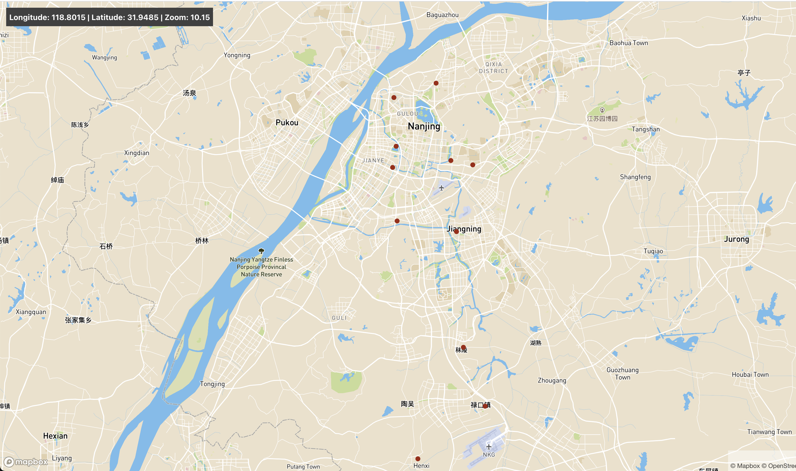

# Covid map web applications

This web application shows the current active Covid-19 cases in Nanjing city. Besides, other map layers (which can be optionally switched on) show the distribution of demographic variables and other factors related to viral transmission.

## How to build the app

If you want to have a quick look of the final product, then skip this section and go to the **"Run the web application"** section below.

### Covid-19 GIS data standards

The Covid-19 cases are recorded using [this standard](https://covidjson.org/), which was developed by Finnish experts for leveraging GIS for helping the Finnish governmental organizations, communities and companies in mitigating the impact of the COVID-19 pandemic in 2020. Based on this standard, [this Covid map for Finland](https://data.covidjson.org/) was generated. The templates of all feature points on maps can be downloaded [here](https://github.com/spatineo/covidjson). We will adopt a similar approach to generate a Covid map for China. 

### Covid-19 cases data source

[This link](https://blogs.mulesoft.com/dev-guides/track-covid-19/) contains a lot of freely available APIs to fetch real-time Covid-19 cases data from different countries. For example, India's published data can be found [here in csv formats](https://api.covid19india.org/) and [here in one of the monthly pdf reports (with even a list of deceased patients' names and other details)](https://dhs.kerala.gov.in/wp-content/uploads/2021/07/Bulletin-HFWD-English-July-07.pdf). 

Unfortunately, there seems to be no immediately available data of similar granularity and quality for China in the public domain. Therefore, **we hope soon people who have access to the original csv format case files can create a convenient API for developers to use**. Because of the lack of stable data API, for this initial commit of code, we use [data from here](https://i.ifeng.com/c/88FRX6NBZcO) which contains officially reported residential areas ranked by level of viral transmission risks. 

#### Convert raw data file to Geojson format

We use Geojson data format to visualize the detailed information of cases on maps. As shown in the folder of ```data/examples```, the "features list" in the Geojson file can be directly used to construct map layers. The data are in ```data/2021-July/Nanjing/data.geojson```. Refer to ```data/getdata.py``` for details about how the conversion from raw news data to geojson data is realized. 

### Create a customized style layer in Mapbox

Follow the [tutorial here (all 3 parts of it)](https://docs.mapbox.com/help/tutorials/add-points-pt-1/) to create a customized style layer using the geojson data just created in the last step. After this process, you will get a mapbox access token and style ID as shown in part 3 of the tutorial. These are the inputs in ```src/Map.js``` needed to show the interactive map in the web app.

## To run the web application

In the root folder, run the following commands one by one in the terminal

```
npm install
npm start
```

Note you may need to run ```npm audit fix --force``` after ```npm install``` if you see high vulnerability issues. This is because many packages used in the original [mapbox sample web app](https://github.com/mapbox/mapbox-react-examples/tree/master/basic) are deprecated. This is optional.

Then open **http://localhost:3000/** in a web browser. 

## Extend the map functionalities

Refer to [Mapbox documentation](https://docs.mapbox.com/help/getting-started/web-apps/) for adding more advanced map layers to allow interactive features, more complex map styles and map-based statistics. 

## A snapshot of the final web app which only requires 10 mins to build

